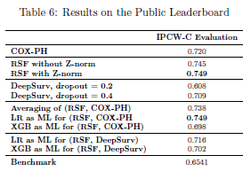

# Data Challenge : Leukemia Risk Prediction
### Selected Challenge
Overall Survival Prediction for patients diagnosed with Myeloid Leukemia by \href{https://www.qube-rt.com/}{\texttt{QRT}} in collaboration with the \href{https://www.gustaveroussy.fr/}{\texttt{Gustave Roussy}} institute. This challenge was carried out as part of the course \href{https://www.college-de-france.fr/fr/agenda/cours/generation-de-donnees-en-ia-par-transport-et-debruitage}{"Génération de Données en IA par Transport et Débruitage"} by Prof. Stéphane Mallat from the Collège de France.

### Team: Nour RIZK, Vivien BRANDT

## Strategy :
### 1. Feature Engineering
   - Ratios (interactions) of the different cell counts (features collected from the clinical data csv) in the blood stream
   - Cytogenetic data :
        - **1st approach** : construct a one-hot encoding of the risk level of the data (High/Low) --> categorical data
        - **2nd approach** : construct a high risk abnormalities dictionary and one-hot encode the presence of those abnormalitites in a patient
        - ** next up** : implement it as a numerical data approach based on thresholds with percentage of risk
   - Molecular data :
        - One-hot encode the Gene Mutation data based on VAF information
        - One-hot encode the Mutation Effect data based on the Effect column
        - **next up :** work on feature selection to reduce correlation and improve the model ipcw c-index
        - **next up :** train a model (such as a word2vec or VAE) on the molecular data before feeding it to the models$
   - Merging the processed Clinical and Molecular data
   - Filtering highly correlated data
   - Imputing the data with the median value
   - Standardizing the data
   - Selecting a strategy : either train/test split, or cross validation (both are implemented)
 
### 2. Trained models :
   - COX Proportional Hazard model with Ridge regularization $0.72$
   - Random Survival Forest model
          - without Znormalizing the data : $0.745$
          - with Z-normalizing the data : $0.749$
   - DeepSurv with Regularization and Dropout
  
Implemented a grid search for all models.

### 3. Defining 2 pairs of models' prediction score for applying ensemble methods :
   - (COX-PH, RSF)
   - (DeepSurv, RSF)
  
Z-normalizing the data before stacking it and feeding it to the Meta Learners

### 4. Ensemble Methods :
   - Averaging prediction scores of a given pair
   - Linear Regression as a Meta Learner
   - XGBoost as a Meta Learner

## Results 
The table below displays the results of the various implemented methods, given by the Public Leaderboard of the submission platform

   
